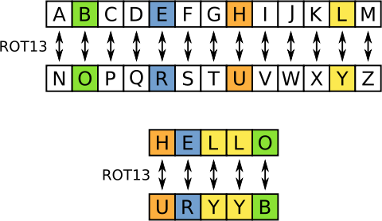

!SLIDE

# Introducción a Test Driven Development.

"¿Cuanta libertad querés para programar?"
----------------------------------------

*por Gastón Ramos*

!SLIDE

# Muchas veces...

* Programar con miedo.
* Miedo a Modificar / Refactorizar.
* Miedo a pasar a producción.
* Miedo a los bugs.
* Desconfianza.

!SLIDE

# Les prometo...

* Más seguros mientras programamos.
* Valentía al Modificar / Refactorizar.
* Producción más rápido y más seguido.
* Menos bugs.
* Confianza.

!SLIDE

# Libertad!

!SLIDE

# Qué es TDD?

Test Driven Development.

Es una herramienta de diseño de software.

!SLIDE

# 2 Simples reglas:

* En TDD escribes nuevo código únicamente si tenés un test que falla.
* Eliminar duplicación.

!SLIDE

# El mantra del TDD

* **[ Red ]**            Test fallando.
* **[ Green ]**          Implementar rápido y sucio. 
* **[ Refactoring ]**    Eliminar la duplicación.

!SLIDE

# Avanzamos de pequeños pasos más seguros.

!SLIDE

# Green bar patterns

Algunos patrones para lograr el verde.

!SLIDE

# Fake it

Return a constant, gradually transform into an expression using variables.

Por qué ?

!SLIDE

Hay dos efectos que hacen que el fake it sea poderoso:

* Psicológico:  Podés refactorear con confianza.

* Scope Control: FOCUS.

!SLIDE

# Triangulate.

Only abstract when you have two or more tests.

    def suma(a, b)
      4
    end

    assert_equal 4, suma(3, 1)

!SLIDE

# Triangulate.

    def suma(a, b)
      a + b
    end

    assert_equal 4, suma(3, 1)
    assert_equal 7, suma(4, 3)

!SLIDE

# Obvious implementation.

Como implementamos las operaciones simples?

Sólamente las implementamos y listo.

!SLIDE

# One to Many

Cómo implementamos una operación que funciona para una colección de objetos?

Primero lo hacemos funcionar para uno sólo y luego hacemos que funcione
para la colección.

!SLIDE

## Ejemplo de TDD. Rot 13

!SLIDE

# TDD patterns

!SLIDE

# Test n.

- *Cómo testeas tu software?*

- *Escribe un test automático.*

!SLIDE

# Isolated test. 

- *Cómo debe afectar la ejecución de los tests entre sí?*

- *Para nada.*

Soluciones altamente cohesivas, débilmente acopladas.

!SLIDE

# Test list.

 - *Qué debo testear?*

 - *Escribe una lista antes de empezar.*

!SLIDE

# Test first.

- *Cuándo debemos escribir nuestros tests?* 

- *Antes de escribir el código que va a ser testeado.* 

!SLIDE

# Consejos, como empezar:

* Concentrarse en aprender a testear.

* No usar nada complicado, Instalar Ruby y usar Minitest.

* Pedir ayuda.

!SLIDE

# FIN. #

Fuente: TDD by example (Kent Beck)

[http://gastonramos.com.ar](http://gastonramos.com.ar)

El código de la charla y los ejemplos de rot-13 están en mi github:

[https://github.com/gramos/truchar-y-triangular](https://github.com/gramos/truchar-y-triangular)
